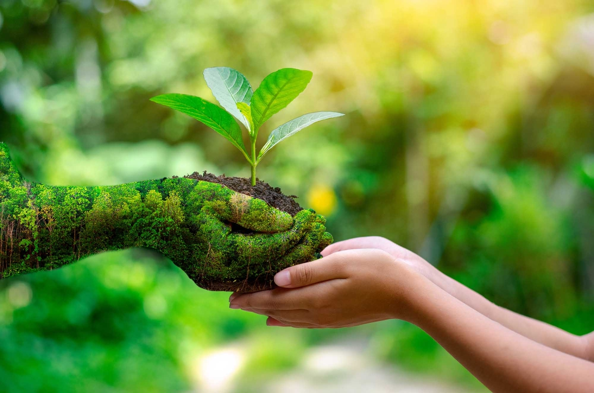

# 🌿 ONG VerdeViva - Preservação e Sustentabilidade

*Esta imagem é um placeholder. 

## 💚 Sobre o Projeto

A **ONG VerdeViva** é um projeto de *landing page* ou site institucional focado na apresentação de uma organização não governamental fictícia dedicada à preservação do meio ambiente e à promoção da sustentabilidade.

Este projeto foi desenvolvido utilizando **HTML5** e **CSS** (o arquivo `estilo.css` correspondente) para demonstrar a estrutura básica de um site informativo, com seções dedicadas a:

* **Sobre:** Apresentação da missão e visão da ONG.
* **Projetos:** Destaque para as ações de reflorestamento e educação ambiental.
* **Voluntariado:** Chamada para engajamento e cadastro de voluntários.
* **Newsletter:** Formulário para captação de e-mails.
* **Contato:** Informações de contato e localização.

## 🚀 Como Rodar a Aplicação

Este projeto é totalmente estático (HTML/CSS) e pode ser visualizado de duas maneiras:

### 1. Visualização Local

1.  **Clone o repositório** para a sua máquina.
2.  Abra o arquivo `index.html` diretamente no seu navegador de preferência (Google Chrome, Firefox, etc.).

### 2. Visualização Online (GitHub Pages)

O projeto está hospedado e acessível online via **GitHub Pages**.

🔗 **[CLIQUE AQUI PARA ACESSAR A PÁGINA AO VIVO][([<LINK-DO-SEU-GITHUB-PAGES>](http://127.0.0.1:5500/index.html))**](https://ronaldo94-cf.github.io/Projeto-Ong-Verde/)

## ⚙️ Estrutura de Arquivos

A estrutura de pastas básica do projeto é a seguinte:
## 🛠️ Tecnologias Utilizadas

* **HTML5:** Estruturação do conteúdo.

## ✍️ Autor

Este projeto foi desenvolvido por:

* **[Ronaldo/Ronaldo94-cd]** - ([Link para o seu perfil do GitHub](https://github.com/Ronaldo94-cf))
